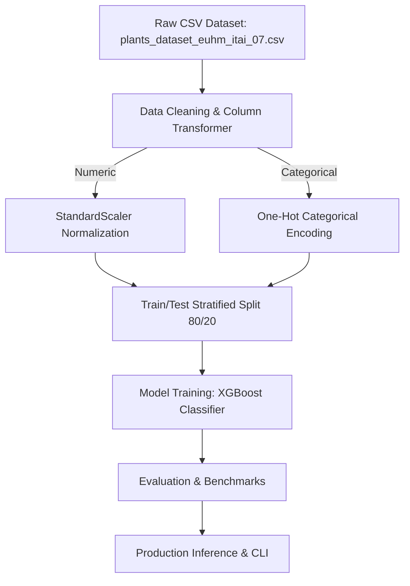

# Botanical Plant Species Classification & Thriving Predictor - Architecture & Pipeline Design

## Comparative Models Evaluated
- **XGBoost Classifier**
- **Random Forest**
- **K-Nearest Neighbors**
- **Multi-Layer Perceptron**
